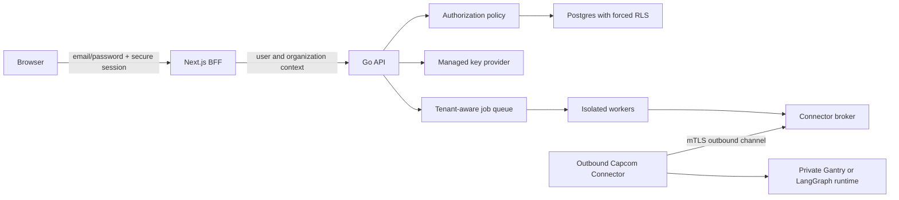

# Hosted Product Foundation

## Status

- Phase: active post-V1 implementation
- Audience: backend, frontend, platform, security, and product engineering
- Scope: foundation required before untrusted users can connect real runtime
  instances to hosted Capcom
- V1 compatibility: local single-operator deployments remain supported during
  migration, but they are not multi-tenant

## Problem

Capcom V1 is a local, single-operator control plane. One admin token authorizes all
API calls, the Next.js proxy injects that token for every console request, database
records have no tenant owner, and workers operate across all configured runtime
connections.

Deploying that model publicly would give every visitor the same administrative
boundary. Adding a login screen alone would not fix it. Hosted Capcom needs
identity, tenant ownership, object-level authorization, database isolation,
per-tenant secret boundaries, safe networking, fair resource use, privacy
lifecycle controls, and a connector for runtimes on private networks.

## Implementation Status

Implemented in the first hosted-auth slice:

- email/password signup and login with confirm-password validation in the UI;
- Argon2id password hashing, generic login failures, dummy verification, and
  account/IP throttling;
- opaque hashed server sessions, HttpOnly/SameSite cookies, CSRF protection,
  logout revocation, and a current-user endpoint;
- automatic personal organizations and owner memberships, with first-account
  adoption of the pre-existing local fleet;
- non-null organization ownership for runtime connections, agents, normalized
  metrics, encrypted secrets, control actions, sync/telemetry runs, and audit
  events, plus organization-scoped runtime, execution, and telemetry reads;
- a responsive split-screen login/signup experience grounded in Capcom's live
  runtime/agent topology;
- removal of the admin token from the Next.js browser proxy. The bearer token is
  retained only for local automation compatibility.

Still required before an untrusted public launch: forced PostgreSQL RLS, full
membership/role management, OIDC, managed per-tenant key envelopes, SSRF-safe
egress policy, quotas and worker isolation, privacy/deletion workflows, and the
secure private-runtime connector.

## Goals

1. Provide secure email-and-password signup and login with revocable server-side
   sessions. Keep OIDC as a later identity option.
2. Make an organization the tenant boundary for every customer-owned resource and
   background job.
3. Enforce authorization in the Go API, services, repositories, and PostgreSQL.
4. Keep runtime connections read-only unless an authorized operator explicitly
   elevates them.
5. Isolate tenant secrets cryptographically and support managed key providers,
   rotation, revocation, and attribution.
6. Prevent runtime endpoints from turning Capcom into an SSRF or unrestricted
   egress proxy.
7. Apply per-user, per-organization, per-connection, and platform-wide limits.
8. Provide auditable onboarding, control, export, deletion, and offboarding flows.
9. Reach private runtimes through an outbound tenant-bound connector instead of
   requiring public inbound access.

## Non-Goals For The First Hosted Beta

- Billing, invoicing, or usage-based entitlements.
- Enterprise SAML, SCIM, or custom role builders.
- OIDC/social login, OTP, MFA, email verification, and an outbound email service.
- Email-based password reset during the initial hosted beta.
- Cross-organization resource sharing.
- A marketplace for adapters or connectors.
- Customer-managed deployment regions.
- Bring-your-own database or bring-your-own KMS.
- A general-purpose network tunnel.

## Security Principles

- Deny by default.
- Never trust a tenant identifier independently of an authenticated session.
- Scope every resource lookup by organization and resource ID.
- Return `404` for resources outside the active organization.
- Apply authorization in the backend even when the frontend hides an action.
- Keep the application database role subject to forced row-level security.
- Separate migration credentials from runtime application credentials.
- Prefer short-lived, narrowly scoped credentials.
- Keep runtime credentials beside the runtime when the connector is available.
- Treat control actions as privileged, attributable operations.
- Preserve audit evidence without logging credentials or sensitive payloads.

## Core Terminology

| Term | Meaning |
|---|---|
| User | A person authenticated with an email and password in the initial release |
| Organization | The tenant and primary data-isolation boundary |
| Membership | A user's role and lifecycle state in one organization |
| Session | A revocable server-side browser session |
| Service account | A non-human identity owned by one organization |
| Runtime connector | An outbound agent that brokers access to private runtimes |
| Platform operator | A narrowly controlled service administrator, separate from organization roles |

Use `organization_id` in code and storage. Do not mix `tenant_id`, `workspace_id`,
and `organization_id` for the same boundary.

## Target Architecture



Direct Capcom-to-runtime connections remain available only under an explicit
deployment policy. The hosted default is connector-based access.

## Identity, Passwords, And Sessions

### Initial Authentication Scope

The first hosted beta uses self-service email-and-password authentication:

- Sign up fields: email, password, confirm password, and acceptance of the current
  Terms and Privacy Policy.
- Login fields: email and password.
- A successful signup atomically creates the user, a personal organization, an
  owner membership, the password credential, and a browser session.
- A successful signup signs the user in directly.
- OTP, MFA, social login, OIDC, email delivery, and email verification are not
  implemented in this phase.

Because there is no email verification service, the email address is an unverified
login identifier. Store `email_verified_at` as null, do not present the address as
verified, and do not use possession of that address as proof for sensitive account
recovery. OIDC and verified-email login can be added later without changing tenant
ownership.

There is no emailed password-reset flow in this phase. Authenticated users can
change their password after entering the current password. The product must state
before launch how an owner who loses their password recovers access; until a
reviewed non-email recovery flow exists, do not promise self-service recovery.

Organization invitation records may generate a short-lived link or code for the
inviter to share out of band. Capcom does not claim to send an invitation email.

### Email Handling

- Trim surrounding whitespace from the email input.
- Parse and validate a reasonable email shape and enforce a bounded length.
- Store the entered display value separately from a normalized lookup value.
- Apply one documented normalization policy consistently for signup and login; do
  not implement provider-specific rewriting such as removing dots from Gmail
  addresses.
- Enforce uniqueness on the normalized value.
- Use generic registration and login failures so responses do not become a reliable
  account-enumeration endpoint.

### Password Policy

Because this phase has no MFA:

- Require at least 15 characters.
- Permit at least 128 characters and reject larger inputs before expensive hashing.
- Permit Unicode, whitespace, and all printable characters.
- Do not require arbitrary uppercase, lowercase, number, or symbol combinations.
- Apply Unicode NFC normalization consistently before length checks, blocklist
  comparison, and hashing; do not trim, case-fold, or silently truncate it.
- Check against a maintained common/breached-password blocklist without sending
  the plaintext password to an untrusted service.
- Show a strength meter and plain-language guidance in the signup form.
- Do not require periodic password changes; require a change after confirmed
  compromise or a credential-format migration.

Hash passwords with Argon2id using a unique random salt and an encoded format that
stores algorithm, version, parameters, salt, and hash. Start at no less than the
current OWASP baseline of 19 MiB memory, 2 iterations, and parallelism 1, then
benchmark stronger memory/time parameters on production hardware. Rehash after
successful login when stored parameters fall behind policy. An optional pepper
belongs in managed secret storage, never in the database.

Use constant-time comparison. For unknown emails, execute a dummy Argon2id verify
with equivalent cost before returning the same generic failure used for an invalid
password. Rate-limit by IP and normalized account identifier, add progressive
backoff, and avoid permanent lockout that can be abused for denial of service.

The confirm-password field is a client-side error-prevention control. Compare it
locally, never persist it, and submit the password once to the API. Pasting and
password-manager autofill remain supported.

### Browser Session

After signup or login, issue an opaque random session token in a cookie configured as
`HttpOnly`, `Secure`, `SameSite=Lax`, and host-only by default. Use a short idle
timeout and bounded absolute lifetime.

Store only a hash of the opaque token server-side. Rotate it after login, role
changes, organization switching, and privilege elevation. Revoke sessions on
logout, user suspension, membership removal, identity unlinking, or security
events.

State-changing browser requests require CSRF protection in addition to SameSite
cookies. Tenant-data responses use `Cache-Control: private, no-store` unless a
route has an explicitly safe caching design.

### Bootstrap And Recovery

- Provision the first hosted platform operator out of band.
- Create organization ownership through an invitation or explicit bootstrap flow.
- Audit recovery actions; recovery must not silently add organization membership.
- Keep `CAPCOM_ADMIN_TOKEN` as a local-development bootstrap only and disable it in
  hosted mode.

## Organizations, Memberships, And Roles

### New Tables

| Table | Important fields |
|---|---|
| `users` | `id`, display email, normalized email, `email_verified_at`, `status`, timestamps |
| `password_credentials` | `user_id`, Argon2id encoded hash, changed/rehash timestamps |
| `organizations` | `id`, `slug`, `name`, `status`, `plan`, timestamps |
| `organization_memberships` | organization, user, role, status, inviter, timestamps |
| `organization_invitations` | organization, invitee, role, token hash, expiry, inviter |
| `sessions` | token hash, user, selected organization, expiry, last seen, client metadata |
| `service_accounts` | organization, name, status, permissions, timestamps |
| `service_tokens` | service account, token hash, prefix, expiry, last used, revocation |

Users have random internal IDs. The normalized email is unique for login but is not
used as a foreign key. A future `oidc_identities` table can link identities by
`(issuer, subject)` without replacing the user ID.

### Initial Roles

| Permission | Owner | Admin | Operator | Viewer |
|---|:---:|:---:|:---:|:---:|
| View fleet, agents, metrics, and audits | yes | yes | yes | yes |
| Create read-only runtime connection | yes | yes | optional | no |
| Manage credentials | yes | yes | no | no |
| Execute approved runtime controls | yes | yes | yes | no |
| Elevate connection to control-enabled | yes | yes | no | no |
| Manage members and invitations | yes | yes | no | no |
| Change roles or remove an owner | yes | limited | no | no |
| Delete organization | yes | no | no | no |

Implement permissions as named constants evaluated by a central policy service.
Handlers declare required permissions; services re-check security-sensitive
mutations. Do not scatter role-name comparisons throughout the code. Prevent
removal or demotion of the final active owner.

## Tenant Context

The request lifecycle is:

1. Authenticate the browser session or service token.
2. Resolve the organization from the URL.
3. Validate active membership or service-account ownership.
4. Construct an immutable principal containing identity, organization, role,
   permissions, session, and request ID.
5. Add the principal to `context.Context`.
6. Open a database transaction and set a transaction-local PostgreSQL organization
   context.
7. Execute tenant-scoped repositories and services.

Organization-scoped URLs are explicit:

```text
/v1/organizations/{organizationId}/runtime-connections
/v1/organizations/{organizationId}/agents
/v1/organizations/{organizationId}/telemetry/usage
```

The URL selects a candidate tenant; membership validation establishes authority.
Never accept an unverified `X-Tenant-ID` header as the security boundary.

## Tenant-Owned Data

Add non-null `organization_id` to every customer-owned table, including:

- runtime connections and endpoint aliases
- agents and runtime bindings
- runtime skills, capabilities, diagnostics, and inventory
- agent skill bindings and delegation edges
- runtime and subagent executions
- desired and actual access state
- drift findings
- control actions
- audit events
- secrets and secret versions
- runtime sync runs
- usage observations and telemetry ingestion runs
- manifests and future webhook inbox records

Copy tenant ownership directly onto child rows even when it can be derived through
a parent. This supports RLS, partitioning, deletion, and reliable auditing without
unsafe joins.

### Keys And Constraints

- Give every tenant table `UNIQUE (organization_id, id)`.
- Use composite foreign keys such as `(organization_id,
  runtime_connection_id)` so children cannot reference another organization.
- Scope natural uniqueness by organization. Secret names become unique by
  `(organization_id, name)` and runtime endpoints by `(organization_id,
  runtime_type, canonical_endpoint)`.
- Include `organization_id` first in common indexes and queue-claim indexes.
- Keep globally unique UUIDs for tracing, but never treat UUID randomness as
  authorization.

### PostgreSQL Row-Level Security

Enable and force RLS on every tenant table. Policies compare `organization_id` to
a transaction-local `app.organization_id` setting. Use separate database roles:

- migration role: owns schema and applies migrations
- application role: no ownership and no `BYPASSRLS`
- maintenance role: narrowly controlled, audited, and unavailable to handlers

RLS is defense in depth. Repository methods still require organization ID and
include it in queries. Missing tenant context fails closed.

## Migration From V1

Migrate in deployable stages:

1. Create identity and organization tables.
2. Create one `legacy-local` organization and an approved owner identity.
3. Add nullable `organization_id` columns and supporting indexes.
4. Backfill every row through its runtime connection or owning parent.
5. Stop on orphaned or ambiguous rows.
6. Update domain objects, repositories, services, workers, and APIs to dual-write
   organization IDs.
7. Validate counts and ownership consistency.
8. Add composite constraints and organization-scoped unique indexes.
9. Make `organization_id` non-null.
10. Enable and force RLS after every application path establishes tenant context.
11. Remove global uniqueness and the hosted admin-token path.

Provide a preflight command that reports rows that cannot be assigned safely. Do
not guess ownership. Back up the database and rehearse rollback before production.

## Object-Level Authorization

Every handler receiving a resource ID calls a tenant-scoped service. Services and
repositories load resources with `(organization_id, resource_id)`.

Required protections include:

- Runtime IDs cannot be read, modified, synced, archived, or controlled across
  organizations.
- Agent and runtime-native IDs cannot escape their organization through search or
  detail endpoints.
- Metrics verify that runtime and agent filters belong to the organization.
- Secret references resolve only within the organization.
- Audit events cannot be queried across organizations by target or actor.
- Background jobs carry an immutable organization ID and recheck ownership after
  claiming the job.
- Platform support access uses a separate time-bound, fully audited workflow.

Maintain a route-to-permission registry and fail CI when a non-public route lacks
an authorization declaration.

## Per-Tenant Secret Boundaries

### Envelope Encryption

Replace the application-wide encryption boundary with envelope encryption:

1. Generate a random data-encryption key (DEK) per organization.
2. Wrap the DEK using an approved managed KMS key-encryption key (KEK).
3. Store only the wrapped DEK and provider metadata.
4. Encrypt each secret with AES-256-GCM using authenticated data containing format
   version, organization ID, secret ID, name, and version.
5. Keep unwrapped DEKs in memory only for a short bounded cache duration.

Introduce a provider-neutral Go interface with managed-KMS and local-development
implementations. Hosted mode must not silently fall back to the local master key.

### Secret Lifecycle

Add `secret_versions` and record creation, rotation, activation, revocation,
expiry, and last-use metadata. Resolve only an active version. Audit metadata may
contain secret ID and version but never plaintext, ciphertext, authorization
headers, or decrypted values.

Support credential verification before activation, atomic rotation with rollback,
expiry notification, immediate revocation, organization offboarding, KEK rewrap,
and separately planned DEK rotation. Prefer connector-local runtime credentials;
hosted Capcom stores one only for approved direct connections.

## Read-Only By Default

- New connections always start as `read_only` regardless of adapter capability.
- The UI cannot request `control_enabled` during initial creation.
- Elevation requires owner/admin permission, recent authentication, typed
  confirmation, actor, reason, and adapter capability/scope preflight.
- Elevation and downgrade produce immutable audit events.
- Organization policy can prohibit control mode.
- Connector policy independently limits allowed actions.
- Emergency downgrade and connector revocation are immediately available.
- Initial hosted-beta control grants expire back to read-only unless renewed.

## Endpoint And Egress Security

### Hosted Default

Hosted Capcom does not make arbitrary requests to user-supplied URLs. The default
connection method is the outbound connector.

### Approved Direct Connections

If direct endpoints are enabled by deployment policy:

- Require HTTPS and an allowed port.
- Reject URL user information, fragments, ambiguous encodings, unsupported schemes,
  and non-canonical hosts.
- Resolve all A and AAAA results before connecting.
- Reject loopback, private, link-local, multicast, carrier-grade NAT,
  documentation, reserved, and cloud-metadata ranges according to policy.
- Pin validated destination addresses in a custom dialer.
- Revalidate every redirect or disable redirects by default.
- Limit response bytes, headers, redirects, connection time, request time, and
  decompression ratio.
- Route traffic through an egress proxy or network policy that independently
  blocks internal and metadata destinations.
- Log normalized destinations without credentials or sensitive query parameters.
- Re-resolve periodically and disable endpoints that move to forbidden addresses.

Adapters receive an approved transport rather than constructing unrestricted
`http.Client` instances.

## Rate Limits, Quotas, And Worker Isolation

Apply limits by unauthenticated IP, user/session, organization, runtime connection,
adapter/action type, connector command, and concurrent stream. Return `429` with
`Retry-After` and useful limit headers. Horizontally scaled hosted services require
a shared limiter; in-memory limiting is development-only.

Initial quotas cover runtime connections, connectors, users, service accounts,
requests, concurrent jobs, minimum sync interval, retained observations,
executions, control actions, outbound bytes, and connector messages.

Workers use organization-partitioned queues, per-organization concurrency limits,
fair scheduling, leases, idempotency keys, and bounded retries. Workers establish
RLS context before using a claimed job and clear it before reuse. One noisy tenant
must not starve others.

## Audit And Security Monitoring

Every security event records organization, actor type and ID, session or service
account, request/correlation IDs, approved client metadata, action, target, reason,
result, safe error code, redacted before/after summaries, and timestamp.

Monitor authentication failures, invitation abuse, role changes, control
elevation, secret access/rotation, connector enrollment/revocation, endpoint-policy
rejection, rate limits, deletion, and platform-support access.

Tenant audit views remain isolated. Platform security aggregates contain only the
minimum metadata required for defense.

## Privacy, Terms, Export, And Deletion

Before accepting public users:

- Publish reviewed Terms of Service and Privacy Policy.
- Document identity, runtime, telemetry, audit, network, and diagnostic data.
- Define purposes, retention, deletion, subprocessors, contacts, and applicable
  regional requirements with qualified counsel.
- Provide user-profile and organization export/deletion requests.
- Provide runtime disconnection and credential revocation independently.

Organization deletion is asynchronous and resumable:

1. Require recent authentication and owner confirmation.
2. Revoke invitations, sessions as appropriate, service tokens, connectors, and
   runtime credentials.
3. Stop and drain tenant jobs.
4. Archive a deletion request with scope and retention decisions.
5. Delete or cryptographically erase tenant operational data.
6. Retain only legally approved minimal audit evidence, pseudonymized as required.
7. Produce a safe auditable completion record.

Audit retention and deletion must be reconciled explicitly. Indefinite retention
is not an acceptable hosted default without documented legal basis.

## Secure Network Connector

### Purpose

The Capcom Connector runs inside the user's network beside Gantry, LangGraph, or a
future runtime. It opens an outbound authenticated channel to hosted Capcom and
executes only adapter operations allowed by local policy. It is not a generic TCP
proxy.

### Enrollment

1. An owner/admin creates a one-time connector enrollment.
2. Capcom displays a short-lived single-use code.
3. The connector exchanges it over TLS for a connector identity and short-lived
   certificate or equivalent workload credential.
4. The credential binds one organization, connector, environment, and declared
   capability set.
5. Enrollment, rotation, and revocation are audited.

### Channel And Protocol

- Outbound TLS only; prefer mTLS with automated short-lived certificate rotation.
- Use a reviewed multiplexed transport with heartbeats and backpressure.
- Commands include organization, connector, runtime, action, request ID, expiry,
  nonce, and idempotency key.
- Reject expired, replayed, wrongly scoped, unsupported, or locally denied commands.
- Size-limit, validate, and redact responses.
- Keep runtime credentials local whenever possible.

### Local Policy

Connector configuration declares local runtimes, adapters, read/control capability,
allowed actions, message limits, logging/redaction, and upgrade policy. Hosted
Capcom cannot elevate beyond this policy. Revocation applies at broker and
connector, and queued commands expire quickly.

## API Surface

Add route groups incrementally:

```text
POST /auth/signup
POST /auth/login
POST /auth/logout
POST /auth/password/change
GET  /v1/me

GET  /v1/organizations
POST /v1/organizations
GET  /v1/organizations/{organizationId}
GET  /v1/organizations/{organizationId}/members
POST /v1/organizations/{organizationId}/invitations

GET  /v1/organizations/{organizationId}/runtime-connections
POST /v1/organizations/{organizationId}/runtime-connections
POST /v1/organizations/{organizationId}/runtime-connections/{id}/control-grants

POST /v1/organizations/{organizationId}/connectors/enrollments
GET  /v1/organizations/{organizationId}/connectors
POST /v1/organizations/{organizationId}/connectors/{id}/revoke

POST /v1/organizations/{organizationId}/exports
POST /v1/organizations/{organizationId}/deletion-requests
```

Update OpenAPI before each route group. Define permissions, audit behavior,
idempotency, rate limits, and errors for every mutation.

## Console Changes

### Authentication Screen

The desktop authentication route uses a true two-column `50 / 50` composition:

```text
┌────────────────────────────────┬────────────────────────────────┐
│                                │                                │
│  Live Capcom fleet topology    │     CAPCOM                     │
│                                │     Sign in | Create account   │
│    runtime ─ control ─ agent   │                                │
│       ╰ telemetry / drift      │     Email                      │
│                                │     Password                   │
│  Govern every agent runtime    │     Confirm password (signup)  │
│  from one control plane.       │     [primary action]            │
│                                │                                │
└────────────────────────────────┴────────────────────────────────┘
```

The left half is not decorative particle noise. It is an animated, simplified
model of Capcom itself:

1. A central control-plane node discovers Gantry and LangGraph runtime nodes.
2. Each runtime unfolds a compact agent-delegation tree.
3. Mint and blue telemetry pulses travel toward the control plane.
4. One edge briefly changes to the existing danger red to represent drift.
5. A restrained reconciliation pulse returns the edge to healthy mint.

Use the existing Capcom identity rather than introducing a new marketing theme:

- canvas `--cv` (`#0a0c10` in dark mode)
- elevated surface `--el` (`#161a22`)
- healthy/control mint `--ac` (`#3de1a0`)
- telemetry blue `--chart-4` (`#5ab0ff`)
- drift red `--dg` (`#f2555a`)
- primary and muted text `--tx` / `--mu`
- Geist Sans for interface and headline copy; Geist Mono for runtime labels, status,
  and topology annotations

Keep the animation calm: one 10–14 second orchestrated loop, no camera movement,
no random particles, no flashing, and no animation behind the form. The signature
moment is the topology changing from discovered, to delegated, to reconciled.

The right half is a quiet form surface with a maximum content width around 420px:

- Brand and one-sentence product description.
- Accessible `Sign in` and `Create account` segmented tabs.
- Persistent labels; placeholders never replace labels.
- Email input with `autocomplete="email"`.
- Login password with `autocomplete="current-password"`.
- Signup password and confirm password with `autocomplete="new-password"`.
- Show/hide controls with accessible names and preserved cursor/focus.
- Signup strength meter and requirements that update without changing layout height.
- Terms and Privacy acknowledgement on signup.
- Primary actions named `Sign in` and `Create account`.
- Field-level validation for malformed input and non-field generic authentication
  errors for credential/account failures.
- Disabled/loading action that preserves its width and announces progress.

Do not show “Forgot password?” while no recovery path exists. A misleading dead-end
is worse than omitting the control. Explain recovery limitations in preview release
notes and support documentation.

At widths below the desktop breakpoint, place the form first and replace the left
half with a compact brand/topology header. Respect `prefers-reduced-motion` by
showing the final static healthy topology. The page must support keyboard-only use,
visible focus, correctly associated labels/errors, screen-reader announcements,
200% zoom, and light/dark contrast.

### Authenticated Console

Add logout and expired-session states, organization creation and switching,
members and invitations, role-aware actions, connector-first read-only onboarding,
recent-password control elevation, connector health/policy/revocation, quota
feedback, security activity, export, credential revocation, and deletion.

The Next.js BFF forwards authenticated session context; it no longer injects a
global admin token in hosted mode.

## Delivery Phases

### Phase 0 — Decisions And Threat Model

- Confirm hosting mode, password/session parameters, future identity-provider
  extension point, KMS, queue/limiter, retention, and connector transport.
- Threat-model tenant context, secrets, SSRF, connectors, workers, controls, and
  support access.
- Produce data classification and deletion inventory.

Gate: security review approves tenant and migration design.

### Phase 1 — Tenant Schema And Migration Harness

- Add identity and organization entities plus legacy bootstrap.
- Add and backfill organization ownership.
- Add tenant-scoped repositories, composite keys, and scoped uniqueness.

Gate: no unowned rows and no possible cross-tenant foreign keys.

### Phase 2 — Email/Password Authentication And Secure Sessions

- Implement signup, login, Argon2id credentials, server sessions, logout, password
  change, CSRF protection, throttling, and revocation.
- Build and accessibility-test the split authentication screen.
- Add `/v1/me` and organization selection.
- Restrict admin-token compatibility to local mode.

Gate: tests cover password policy/storage, enumeration resistance, throttling,
cookies, rotation, expiry, revocation, CSRF, form accessibility, reduced motion,
and responsive layout.

### Phase 3 — Authorization And Database Isolation

- Implement permissions and route declarations.
- Enforce context through handlers, services, repositories, and jobs.
- Enable forced RLS with separate database roles.
- Add organization-scoped APIs and UI switching.

Gate: adversarial tests cannot cross organization boundaries.

### Phase 4 — Secret Boundaries And Safe Control

- Add envelope encryption, managed KMS, secret versions, and lifecycle audit.
- Default to read-only and implement time-bounded elevation.

Gate: ciphertext cannot move across organization/version boundaries, and control
requires explicit elevation.

### Phase 5 — Safe Networking

- Centralize adapter transports.
- Implement canonicalization, address policy, redirects, DNS pinning, egress
  controls, and response limits.
- Disable direct endpoints by default in hosted mode.

Gate: SSRF tests cover IPv4, IPv6, encodings, redirects, DNS changes, metadata, and
mixed public/private results.

### Phase 6 — Quotas, Workers, And Monitoring

- Add shared limiting, quotas, fair queues, tenant concurrency, leases, alerts, and
  runbooks.

Gate: load tests prove tenant fairness and job/result isolation.

### Phase 7 — Privacy And Lifecycle

- Publish reviewed legal documents.
- Implement export, revocation, user deletion, and organization deletion.

Gate: deletion rehearsal safely removes or erases all in-scope data.

### Phase 8 — Connector Alpha

- Build enrollment, identity rotation, broker, protocol, local policy, health,
  upgrades, and revocation.
- Support read-only Gantry, then LangGraph, then approved controls.

Gate: compromise/replay tests cannot cross organizations or expand local policy.

### Phase 9 — Invite-Only Hosted Beta

- Run external security review and dependency/container scanning.
- Exercise backup/restore, KMS, authentication, queue, connector, and incident
  failures.
- Onboard a small number of approved tenants.

Gate: all hosted launch criteria pass with evidence and owners.

## Required Tests

### Identity And Sessions

- email normalization, uniqueness, and bounded validation
- signup password/confirmation interaction and password-manager compatibility
- minimum/maximum length, Unicode, whitespace, blocklist, and no truncation
- Argon2id format, parameter migration, dummy verification, and constant-time paths
- generic signup/login errors and timing-enumeration resistance
- IP/account throttling, progressive backoff, and safe recovery from throttling
- login CSRF and session fixation
- cookie attributes, expiry, rotation, logout, and revocation
- current-password verification for password change and privileged reauthentication
- suspended users and removed memberships

### Tenant Isolation

- every resource endpoint with an ID from another organization
- list, search, metrics, export, and audit filters
- composite foreign-key rejection
- forced RLS with the real application role
- missing context fails closed
- cache, queue, idempotency, and limiter keys include organization
- worker reuse clears prior tenant context

### Secrets And Controls

- cross-organization and wrong-version ciphertext swaps
- rotation, rollback, expiry, and revocation
- no plaintext/ciphertext in audit or errors
- read-only database/API default
- elevation permission, recent auth, expiry, and emergency downgrade

### Networking

- loopback, private, link-local, metadata, multicast, reserved, and IPv6 addresses
- decimal, octal, hexadecimal, Unicode, and mixed encodings
- DNS rebinding and mixed answers
- redirects to forbidden destinations
- oversized, slow, compressed, and streaming responses
- adapters cannot replace the approved transport

### Connector

- single-use enrollment and expiry
- organization/connector identity binding
- rotation and revocation
- replay, expiry, tampering, and wrong-runtime rejection
- local policy denial despite hosted permission
- disconnect, backpressure, duplicate delivery, and safe retry
- secret and payload redaction

### Lifecycle

- invitation expiry and role changes
- final-owner protection
- export isolation
- resumable deletion
- revocation before deletion
- explicit audit-retention exceptions

## Hosted Launch Criteria

Do not let public users connect real instances until:

- Email/password authentication and secure server-side sessions are production-ready.
- Every tenant row has non-null organization ownership.
- Authorization and forced-RLS tests pass.
- Global admin-token access is disabled in hosted mode.
- Managed per-tenant envelope encryption and rotation operate successfully.
- Connections default to read-only and control elevation is bounded and audited.
- Arbitrary direct egress is disabled or the complete endpoint policy is enforced.
- Shared limits, quotas, worker fairness, and monitoring are active.
- Privacy, terms, export, revocation, and deletion are published and tested.
- Connector protocol and isolation review passes.
- Backup, restore, incident response, and key-recovery exercises succeed.
- Independent assessment has no unresolved critical or high findings.

Until then, hosted Capcom must use synthetic data and disable credential entry and
control actions.

## Decision Records Required Before Coding

1. Organization isolation and PostgreSQL RLS transaction model.
2. Password credential format, session storage, and future identity-provider
   extension point.
3. Authorization policy representation.
4. KMS provider and envelope format.
5. Queue and shared limiter technology.
6. Direct endpoint and egress policy.
7. Connector transport, identity, enrollment, and upgrade model.
8. Data retention, deletion, and audit exceptions.
9. Platform support and emergency access.

## References

- [OWASP Authentication Cheat Sheet](https://cheatsheetseries.owasp.org/cheatsheets/Authentication_Cheat_Sheet.html)
- [OWASP Password Storage Cheat Sheet](https://cheatsheetseries.owasp.org/cheatsheets/Password_Storage_Cheat_Sheet.html)
- [OWASP Session Management Cheat Sheet](https://cheatsheetseries.owasp.org/cheatsheets/Session_Management_Cheat_Sheet.html)
- [NIST SP 800-63B](https://pages.nist.gov/800-63-4/sp800-63b.html)
- [OWASP Multi-Tenant Security Cheat Sheet](https://cheatsheetseries.owasp.org/cheatsheets/Multi_Tenant_Security_Cheat_Sheet.html)
- [OWASP Secrets Management Cheat Sheet](https://cheatsheetseries.owasp.org/cheatsheets/Secrets_Management_Cheat_Sheet.html)
- [OWASP SSRF Prevention Cheat Sheet](https://cheatsheetseries.owasp.org/cheatsheets/Server_Side_Request_Forgery_Prevention_Cheat_Sheet.html)
- [OWASP API Security: Broken Object Level Authorization](https://owasp.org/API-Security/editions/2023/en/0xa1-broken-object-level-authorization/)
